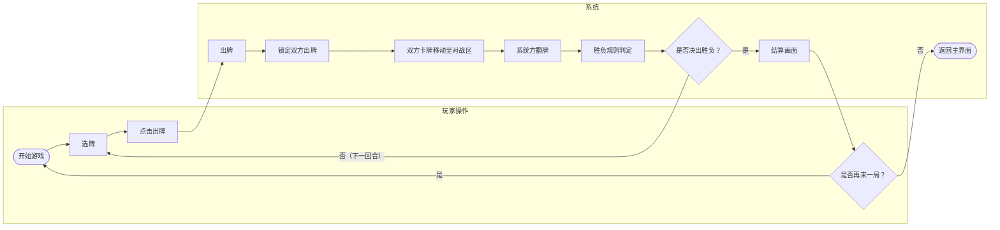

```mermaid
flowchart LR
    %% =========================
    %% 玩家操作泳道
    %% =========================
    subgraph Player["玩家操作"]
        P0([开始游戏])
        P1[选牌]
        P2[点击出牌]
        P3{是否再来一局？}
    end

    %% =========================
    %% 系统泳道
    %% =========================
    subgraph System["系统"]
        S1[出牌]
        S2[锁定双方出牌]
        S3[双方卡牌移动至对战区]
        S4[系统方翻牌]
        S5[胜负规则判定]
        S6{是否决出胜负？}
        S7[结算画面]
        S8([返回主界面])
    end
    
    %% =========================
    %% 主流程
    %% =========================
    P0 --> P1
    P1 --> P2
    P2 --> S1
    S1 --> S2
    S2 --> S3
    S3 --> S4
    S4 --> S5
    S5 --> S6
    
    %% =========================
    %% 分支逻辑
    %% =========================
    S6 -- 否（下一回合） --> P1
    S6 -- 是 --> S7
    S7 --> P3
    
    P3 -- 是 --> P0
    P3 -- 否 --> S8
```