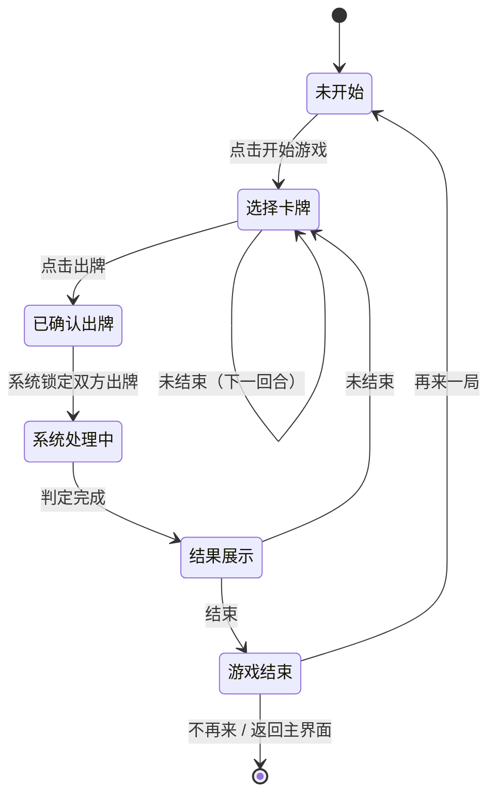

```mermaid
stateDiagram-v2
    [*] --> Idle

    %% =========================
    %% 核心状态定义
    %% =========================
    Idle: 未开始
    Selecting: 选择卡牌
    Confirmed: 已确认出牌
    Resolving: 系统处理中
    Result: 结果展示
    End: 游戏结束

    %% =========================
    %% 状态迁移
    %% =========================
    Idle --> Selecting : 点击开始游戏

    Selecting --> Confirmed : 点击出牌
    Selecting --> Selecting : 未结束（下一回合）

    Confirmed --> Resolving : 系统锁定双方出牌

    Resolving --> Result : 判定完成

    Result --> Selecting : 未结束
    Result --> End : 结束

    End --> Idle : 再来一局
    End --> [*] : 不再来 / 返回主界面
```
